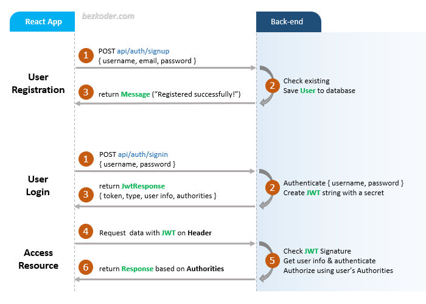

Source: 
- https://github.com/bezkoder/react-jwt-auth
- https://mherman.org/blog/dockerizing-a-react-app/

Command:
sudo docker build -f Dockerfile.prod -t sample:prod . &
sudo docker-compose -f docker-compose.prod.yml up -d --build &


## React JWT Authentication (without Redux) example

In this tutorial, we’re gonna build a React JWT Authentication example with LocalStorage, React Router, Axios and Bootstrap (without Redux). I will show you:

- JWT Authentication Flow for User Signup & User Login
- Project Structure for React JWT Authentication (without Redux) with LocalStorage, React Router & Axios
- Creating React Components with Form Validation
- React Components for accessing protected Resources (Authorization)
- Dynamic Navigation Bar in React App

## User Registration and User Login Flow
For JWT Authentication, we’re gonna call 2 endpoints:

- POST `api/auth/signup` for User Registration
- POST `api/auth/signin` for User Login

The following flow shows you an overview of Requests and Responses that React Client will make or receive. This React Client must add a JWT to HTTP Header before sending request to protected resources.



## Demo Video
This is full React + Node.js Express JWT Authentication & Authorization demo (with form validation, check signup username/email duplicates, test authorization with 3 roles: Admin, Moderator, User):

[](http://www.youtube.com/watch?v=tNcWX9qPcCM "React + Node.js Express JWT Authentication & Authorization demo")

Or React with Spring Boot Server:

[](http://www.youtube.com/watch?v=CsgtYvlR7xk "Spring Boot Reactjs JWT Authentication example")

## React Component Diagram with Router, Axios & LocalStorage


For more detail, please visit:
> [React (without Redux) JWT Authentication & Authorization example](https://www.bezkoder.com/react-jwt-auth/)

> [React JWT Authentication & Authorization example with HttpOnly Cookie](https://www.bezkoder.com/react-login-example-jwt-hooks/)

> [React - How to Logout when Token is expired](https://www.bezkoder.com/react-logout-token-expired/)

> [React Redux JWT Authentication & Authorization example](https://www.bezkoder.com/react-redux-jwt-auth/)

> [React Hooks: JWT Authentication & Authorization example](https://www.bezkoder.com/react-hooks-jwt-auth/)

> [React + Redux + Hooks: JWT Authentication & Authorization example](https://www.bezkoder.com/react-hooks-redux-login-registration-example/)

This project was bootstrapped with [Create React App](https://github.com/facebook/create-react-app).

### Set port
.env
```
PORT=8081
```

## Note:
Open `src/services/auth-header.js` and modify `return` statement for appropriate back-end (found in the tutorial).

```js
export default function authHeader() {
  const user = JSON.parse(localStorage.getItem('user'));

  if (user && user.accessToken) {
    // return { Authorization: 'Bearer ' + user.accessToken }; // for Spring Boot back-end
    return { 'x-access-token': user.accessToken };             // for Node.js Express back-end
  } else {
    return {};
  }
}
```

## Project setup

In the project directory, you can run:

```
npm install
# or
yarn install
```

or

### Compiles and hot-reloads for development

```
npm start
# or
yarn start
```

Open [http://localhost:8081](http://localhost:8081) to view it in the browser.

The page will reload if you make edits.

## Related Posts
> [In-depth Introduction to JWT-JSON Web Token](https://www.bezkoder.com/jwt-json-web-token/)

> [React.js CRUD example to consume Web API](https://www.bezkoder.com/react-crud-web-api/)

> [React Pagination example](https://www.bezkoder.com/react-pagination-material-ui/)

> [React File Upload with Axios and Progress Bar to Rest API](https://www.bezkoder.com/react-file-upload-axios/)

Fullstack (JWT Authentication & Authorization example):
> [React + Spring Boot](https://www.bezkoder.com/spring-boot-react-jwt-auth/)

> [React + Node.js Express](https://www.bezkoder.com/react-express-authentication-jwt/)

CRUD with Node.js Express:
> [React.js + Node.js Express + MySQL](https://www.bezkoder.com/react-node-express-mysql/)

> [React.js + Node.js Express + PostgreSQL](https://www.bezkoder.com/react-node-express-postgresql/)

> [React.js + Node.js Express + MongoDB](https://www.bezkoder.com/react-node-express-mongodb-mern-stack/)

CRUD with Spring Boot:
> [React.js + Spring Boot + MySQL](https://www.bezkoder.com/react-spring-boot-crud/)

> [React.js + Spring Boot + PostgreSQL](https://www.bezkoder.com/spring-boot-react-postgresql/)

> [React.js + Spring Boot + MongoDB](https://www.bezkoder.com/react-spring-boot-mongodb/)

CRUD with Django:
> [React.js + Django Rest Framework](https://www.bezkoder.com/django-react-axios-rest-framework/)

Serverless:
> [React Firebase CRUD App with Realtime Database](https://www.bezkoder.com/react-firebase-crud/)

> [React Firestore CRUD App example | Firebase Cloud Firestore](https://www.bezkoder.com/react-firestore-crud/)

Integration (run back-end & front-end on same server/port)
> [Integrate React with Spring Boot](https://www.bezkoder.com/integrate-reactjs-spring-boot/)

> [Integrate React with Node.js Express](https://www.bezkoder.com/integrate-react-express-same-server-port/)
